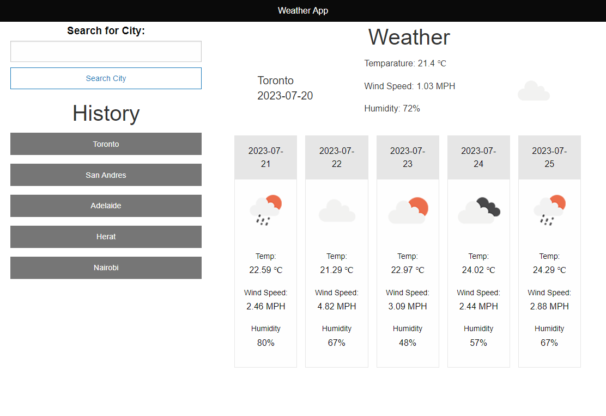

# WeatherWise

This is a simple weather application that allows users to search for the weather details of a city. The app fetches data from the OpenWeatherMap API to display current weather information and a five-day forecast.

## Link

[WeatherWise](https://mwangir.github.io/WeatherWise/)

## Features

- Search for a city and get current weather details.
- View the five-day weather forecast for the searched city.
- Save searched cities to local storage for easy access.

## Dependencies

This project uses the following technologies and libraries:

- [OpenWeatherMap API](https://openweathermap.org/api): Provides weather data for various cities.
- [Foundation](https://get.foundation/): A responsive front-end framework for building user interfaces.
- [jQuery UI Autocomplete](https://jqueryui.com/autocomplete/): Enables autocomplete functionality for city names.

## API Key

To make API requests to OpenWeatherMap, the app uses an API key that you need to obtain from the [OpenWeatherMap website](https://openweathermap.org/appid). Once you have the API key, replace `apikey` in the `weatherAPI()` function with your API key.

## Functions and Their Descriptions

1. `weatherAPI(cityName)`: This function fetches weather data for the specified city using the OpenWeatherMap API. It displays the current weather details on the page, including temperature, wind speed, and humidity.

2. `saveToLocal()`: This function saves the searched city to the browser's local storage. It maintains a list of previously searched cities for easy access in the future.

3. `loadFromLocal()`: This function loads previously saved cities from the browser's local storage and displays them on the page. Users can click on a saved city to view its weather details again.

4. `showMessage(loadedCode, loadedData)`: This function displays an alert message on the page when there is an error fetching weather data. It helps inform users about issues such as city not found (status code "404").

5. `unixToDate(unixTimestamp)`: This utility function converts a Unix timestamp to a human-readable date format (YYYY-MM-DD). It is used for formatting the date in the five-day weather forecast.

6. `removeElement(element, delay)`: This utility function removes the specified element from the DOM after a given delay (in milliseconds). It is used to remove the temporary alert messages displayed by `showMessage()`.

7. `forecast(cityName)`: This function fetches the five-day weather forecast for the specified city using the OpenWeatherMap API. It displays the forecast on the page, including temperature, wind speed, and humidity for each day.

8. `searchBtnEL.addEventListener("click", (e) => { ... })`: This event listener is attached to the search button element (`searchBtnEL`). When the button is clicked, it triggers the weather search process and updates the UI with the current weather and forecast.

9. `Foundation.addToJquery($)` and `$(document).foundation()`: These lines initialize the Foundation CSS framework and add some extra functionality to jQuery, enabling the use of Foundation's responsive styles and features.

10. `$(document).ready(function () { ... })`: This function enables autocomplete functionality for the city input field using jQuery UI Autocomplete. It makes an AJAX request to fetch city data from the [all-countries-and-cities-json](https://github.com/russ666/all-countries-and-cities-json) repository on GitHub. As the user types in the input field, it filters the matching cities and displays them as autocomplete suggestions. When the user selects a city from the autocomplete list, it populates the input field with the selected city name.

## Screenshots

## Contributing

Contributions are welcome! If you find any issues or have suggestions for improvements, feel free to create a pull request or open an issue.
